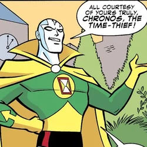

# zod-chronos

[](https://badge.fury.io/js/zod-chronos)
[](https://opensource.org/licenses/MIT)
[](https://www.typescriptlang.org/)
[](https://github.com/colinhacks/zod)
[](https://codecov.io/gh/pablolmedorado/zod-chronos)

[Zod](https://zod.dev) schemas for the JavaScript [Temporal API](https://developer.mozilla.org/en-US/docs/Web/JavaScript/Reference/Global_Objects/Temporal).


## Table of Contents
- [Why the name?](#why-the-name)
- [Features](#features)
- [Requirements](#requirements)
- [Installation](#installation)
- [Usage](#usage)
  - [Extended Zod Instance](#1-using-the-extended-zod-instance-recommended)
  - [Individual Schema Functions](#2-using-individual-schema-functions)
- [API Reference](#api-reference)
  - [Available Schemas](#available-schemas)
  - [Coercion](#coercion)
  - [Error Messages](#error-messages)
  - [Integration with Zod Features](#integration-with-zod-features)
- [Examples](#examples)
- [Contributing](#contributing)
- [License](#license)

## Why the name?

Just as Zod takes its name from [General Zod](https://dc.fandom.com/wiki/Dru-Zod), the Kryptonian supervillain from DC Comics, this package continues the DC Universe naming tradition with [Chronos](https://dc.fandom.com/wiki/Chronos) – a time-obsessed supervillain who has faced off against heroes like the Atom and the Justice League.

Like Chronos' mastery over time, `zod-chronos` gives you the power to handle Temporal objects with precision and confidence.



## Features

- ✨ **Type Safety**: Full TypeScript support with accurate type inference
- 🔒 **Runtime Validation**: Ensure your Temporal objects are valid at runtime
- 🎯 **Type Validation**: Validate that values are instances of the correct Temporal type
- 🔄 **String Coercion**: Automatically convert string representations to Temporal objects
- 🛠️ **Zod Integration**: Seamlessly works with Zod's powerful features
- 📝 **Custom Error Messages**: Customize validation error messages to match your needs

## Requirements

- Node.js >= 14.0.0
- [Temporal API Polyfill](https://github.com/tc39/proposal-temporal) (until native support lands in Node.js)
- Zod >= 3.0.0

## Installation

```bash
npm install zod-chronos
```

> [!IMPORTANT]  
> This package requires `zod` as a peer dependency.

## Usage

You can use this package in two ways:

### 1. Using the Extended Zod Instance (Recommended)

```typescript
import { z } from 'zod';
import { withTemporal } from 'zod-chronos';

// Create an extended Zod instance with Temporal support
const z = withTemporal(z);

// Basic validation
const instantSchema = z.temporalInstant();
const now = Temporal.Now.instant();
instantSchema.parse(now); // ✅ OK
instantSchema.parse('invalid'); // ❌ Throws ZodError

// String coercion
const coerceSchema = z.coerce.temporalInstant();
coerceSchema.parse('2024-02-09T12:00:00Z'); // ✅ Returns Temporal.Instant
coerceSchema.parse(now); // ✅ Returns the same instant

// Custom error messages
const customSchema = z.temporalInstant({
  invalid_type: 'Please provide a valid timestamp'
});

// Combine with other Zod features
const optionalSchema = z.temporalInstant().optional();
const arraySchema = z.array(z.temporalInstant());
const objectSchema = z.object({
  timestamp: z.temporalInstant(),
  timezone: z.temporalTimeZone(),
});
```

### 2. Using Individual Schema Functions

```typescript
import { z } from 'zod';
import {
  temporalInstant,
  temporalPlainDate,
  coercedTemporalInstant,
} from 'zod-chronos';

// Basic validation
const instantSchema = temporalInstant();
const dateSchema = temporalPlainDate();

// With coercion
const coerceSchema = coercedTemporalInstant();

// With custom error messages
const customSchema = temporalInstant({
  invalid_type: 'Please provide a valid timestamp'
});

// Combine with other Zod features
const schema = z.object({
  timestamp: temporalInstant(),
  date: temporalPlainDate().optional(),
  coercedInstant: coercedTemporalInstant(),
});
```

## Available Schemas

All schemas are available both through the extended Zod instance and as individual functions.

### Base Schemas

| Object | Extended Schema | Functional Schema |
|--------|---------------|------------------|
| [Instant](https://developer.mozilla.org/en-US/docs/Web/JavaScript/Reference/Global_Objects/Temporal/Instant) | `z.temporalInstant()` | `temporalInstant()` |
| [PlainDate](https://developer.mozilla.org/en-US/docs/Web/JavaScript/Reference/Global_Objects/Temporal/PlainDate) | `z.temporalPlainDate()` | `temporalPlainDate()` |
| [PlainTime](https://developer.mozilla.org/en-US/docs/Web/JavaScript/Reference/Global_Objects/Temporal/PlainTime) | `z.temporalPlainTime()` | `temporalPlainTime()` |
| [PlainDateTime](https://developer.mozilla.org/en-US/docs/Web/JavaScript/Reference/Global_Objects/Temporal/PlainDateTime) | `z.temporalPlainDateTime()` | `temporalPlainDateTime()` |
| [ZonedDateTime](https://developer.mozilla.org/en-US/docs/Web/JavaScript/Reference/Global_Objects/Temporal/ZonedDateTime) | `z.temporalZonedDateTime()` | `temporalZonedDateTime()` |
| [Duration](https://developer.mozilla.org/en-US/docs/Web/JavaScript/Reference/Global_Objects/Temporal/Duration) | `z.temporalDuration()` | `temporalDuration()` |
| [TimeZone](https://developer.mozilla.org/en-US/docs/Web/JavaScript/Reference/Global_Objects/Temporal/TimeZone) | `z.temporalTimeZone()` | `temporalTimeZone()` |
| [Calendar](https://developer.mozilla.org/en-US/docs/Web/JavaScript/Reference/Global_Objects/Temporal/Calendar) | `z.temporalCalendar()` | `temporalCalendar()` |

### Coercion

Each schema has a coercion variant that accepts either:
- A Temporal object of the correct type
- A string that can be parsed into the correct Temporal type

| Access Method | Example |
|--------------|---------|
| Extended | `z.coerce.temporalInstant()` |
| Functional | `coercedTemporalInstant()` |

```typescript
// Using extended instance
const schema1 = z.coerce.temporalInstant();

// Using functional approach
const schema2 = coercedTemporalInstant();

// Both of these work with either approach:
schema1.parse(Temporal.Now.instant()); // Returns the same instant
schema1.parse('2024-02-09T12:00:00Z'); // Returns a new Temporal.Instant
```

### Error Messages

All schemas accept an optional options object to customize error messages:

```typescript
interface TemporalErrorMessage {
  invalid_type?: string;
}

// Using extended instance
const schema1 = z.temporalInstant({
  invalid_type: 'Please provide a valid timestamp'
});

// Using functional approach
const schema2 = temporalInstant({
  invalid_type: 'Please provide a valid timestamp'
});
```

## Integration with Zod Features

All schemas, whether created through the extended instance or functional approach, support Zod's built-in features. Here are some examples:

```typescript
import { z } from 'zod';
import { withTemporal, temporalInstant, temporalZonedDateTime } from 'zod-chronos';

// Using extended instance
const extZ = withTemporal(z);
const schema1 = extZ.temporalInstant()
  .nullable()
  .default(Temporal.Now.instant())
  .refine(instant => instant.epochSeconds > 0);

// Using functional approach
const schema2 = temporalInstant()
  .nullable()
  .default(Temporal.Now.instant())
  .refine(instant => instant.epochSeconds > 0);

// Complex objects work with both approaches
const eventSchema1 = extZ.object({
  title: z.string(),
  startTime: extZ.coerce.temporalZonedDateTime(),
  duration: extZ.coerce.temporalDuration(),
});

const eventSchema2 = z.object({
  title: z.string(),
  startTime: coercedTemporalZonedDateTime(z)(),
  duration: coercedTemporalDuration(z)(),
});
```

For more information about these features, see the [Zod documentation](https://zod.dev/).

## Examples

### Basic Validation

```typescript
import { z } from 'zod';
import { withTemporal } from 'zod-chronos';

const z = withTemporal(z);

// Validate an Instant
const instantSchema = z.temporalInstant();
const now = Temporal.Now.instant();
instantSchema.parse(now); // ✅ OK

// Validate a PlainDate
const dateSchema = z.temporalPlainDate();
const today = Temporal.Now.plainDateISO();
dateSchema.parse(today); // ✅ OK
```

### Complex Object Validation

```typescript
const eventSchema = z.object({
  title: z.string(),
  startTime: z.coerce.temporalZonedDateTime(),
  duration: z.coerce.temporalDuration(),
  timezone: z.temporalTimeZone(),
  recurrence: z.object({
    frequency: z.enum(['daily', 'weekly', 'monthly']),
    until: z.coerce.temporalPlainDate().optional(),
  }).optional(),
});

const event = eventSchema.parse({
  title: 'Team Meeting',
  startTime: '2024-03-15T10:00:00[America/New_York]',
  duration: 'PT1H',
  timezone: 'America/New_York',
  recurrence: {
    frequency: 'weekly',
    until: '2024-06-15',
  },
});
```

## Contributing

Contributions are welcome! Please feel free to submit a Pull Request. For major changes, please open an issue first to discuss what you would like to change.

1. Fork the repository
2. Create your feature branch (\`git checkout -b feature/AmazingFeature\`)
3. Commit your changes (\`git commit -m 'Add some AmazingFeature'\`)
4. Push to the branch (\`git push origin feature/AmazingFeature\`)
5. Open a Pull Request

## License

MIT 